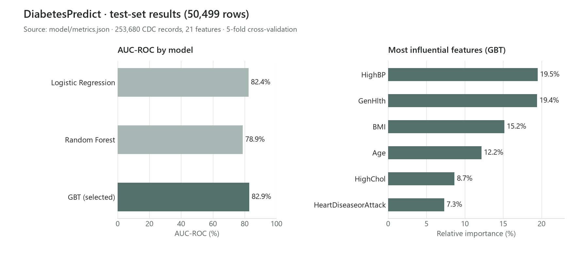
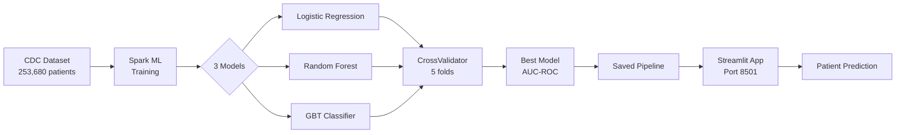

# 🩺 DiabetesPredict — Diabetes Risk Prediction Tool

> **In short:** a reproducible Spark ML pipeline that predicts type 2 diabetes risk from 21 health indicators (253,680 CDC records), compares 3 models with 5-fold cross-validation and serves the selected model in a Dockerized Streamlit app.
>
> **Result:** Gradient Boosted Trees selected, **AUC-ROC 82.9%**, accuracy 86.45%, F1 82.65% on 50,499 test rows · **Stack:** PySpark, Spark ML, Streamlit, Docker · **Portfolio:** [abdou-salou.github.io](https://abdou-salou.github.io/en)



> **Big Data Project** — 2nd Year Engineering Student  
> Module: *Advanced Applications and Big Data Visualization*

---

## 📋 Project Overview

**DiabetesPredict** is a smart diabetes risk prediction tool built on distributed Machine Learning using **Apache Spark ML**. The application analyzes a patient's health profile based on 21 clinical and demographic indicators to evaluate their probability of developing type 2 diabetes.

### Main Features:
- 🤖 **3 ML Models** trained and compared (Logistic Regression, Random Forest, GBT)
- 📊 **5-fold Cross-validation** for robust performance evaluation
- 🎯 **Automated Selection** of the best model (based on AUC-ROC)
- 🖥️ **Interactive Streamlit Interface** with a professional design
- 🐳 **Dockerized architecture** for simple, reproducible deployment
- 📈 **Plotly Visualizations**: gauge charts, radar charts, and comparative bars

---

## 🏗️ Technical Architecture

```
┌─────────────────────────────────────────────────────────────────────┐
│                        Docker Compose                               │
│                                                                     │
│  ┌───────────────────────┐       ┌────────────────────────────────┐ │
│  │   spark-trainer        │       │   streamlit-app                │ │
│  │   (one-shot)           │       │   (web server)                │ │
│  │                        │       │                                │ │
│  │  ┌──────────────────┐  │       │  ┌──────────────────────────┐ │ │
│  │  │  spark_ml/        │  │       │  │  streamlit_app/           │ │ │
│  │  │  train.py         │ ─┼───┐   │  │  app.py                  │ │ │
│  │  └──────────────────┘  │   │   │  └──────────────────────────┘ │ │
│  └───────────────────────┘   │   │                                │ │
│                               │   │  Port 8501                    │ │
│                               │   └───────────┬──────────────────┘ │
│  ┌─────────────────────────┐  │               │                    │
│  │  Shared Volumes         │  │               │                    │
│  │  ├── /data/             │◄─┘               │                    │
│  │  │   └── dataset.csv   │                   │                    │
│  │  └── /model/            │◄─────────────────┘                    │
│  │      ├── best_model/    │    (loading)                        │
│  │      └── metrics.json   │                                       │
│  └─────────────────────────┘                                       │
└─────────────────────────────────────────────────────────────────────┘
```



---

## 📁 Project Structure

```
diabetes-predict/
│
├── docker-compose.yml           # Docker services orchestration
├── Dockerfile                   # Shared Dockerfile for Spark & Streamlit
├── requirements.txt             # Python dependencies
├── README.md                    # This file
│
├── data/                        # Data folder (downloaded dynamically)
│
├── model/
│   ├── best_model/              # Saved Spark ML pipeline (generated)
│   └── metrics.json             # Performance metrics (generated)
│
├── spark_ml/
│   ├── train.py                 # Full training script
│   └── predict.py               # Loading and prediction module
│
└── streamlit_app/
    └── app.py                   # Streamlit web interface
```

---

## 🚀 Getting Started

### Prerequisites
- **Docker** & **Docker Compose** installed
- **~4 GB RAM** available for Spark

### Steps

```bash
# 1. Clone the project
git clone <repo-url>
cd diabetes-predict

# 2. Launch training + application
# The dataset will be automatically downloaded from UCI during training.
docker-compose up --build

# 3. Access the Streamlit interface
#    Open: http://localhost:8501
```

### Useful Commands

```bash
# Rerun only the training
docker-compose run spark-trainer

# Rerun only the UI
docker-compose up streamlit-app

# Stop all services
docker-compose down

# View logs
docker-compose logs -f
```

---

## 🤖 Machine Learning Models

### Spark ML Pipeline

The processing pipeline consists of 3 stages:

1. **VectorAssembler** — Assembles 21 features into a single vector
2. **StandardScaler** — Normalizes features (mean=0, std dev=1)
3. **Classifier** — One of the 3 models below

### Trained Models

| Model | Description | Hyperparameters |
|--------|-------------|-----------------|
| Logistic Regression | 86.28% | 82.44% | 82.82% |
| Random Forest | 85.95% | 78.88% | 79.45% |
| **GBT Classifier** | Gradient Boosted Trees | `maxIter=50`, `maxDepth=[5, 8]`, `stepSize=[0.1, 0.2]` |

Each model is optimized via **CrossValidator** with **5 folds**, targeting **AUC-ROC** maximization.

---

## 📊 Results (test set, 50,499 rows)

| Model | Accuracy | AUC-ROC | F1-Score |
|--------|----------|---------|----------|
| Logistic Regression | 86.3% | 82.4% | 82.8% |
| Random Forest | 86.0% | 78.9% | 79.5% |
| **Gradient Boosted Trees** | 86.45% | 82.92% | 82.65% |

> Source: `model/metrics.json`. The classes are imbalanced, so AUC-ROC, not accuracy, is the model-selection metric.

--------|----------|---------|----------|
| Logistic Regression | ~74% | ~82% | ~74% |
| Random Forest | ~75% | ~83% | ~74% |
| **GBT Classifier** | **~76%** | **~83%** | **~75%** |

> ⚠️ Results may vary slightly depending on the data split.

---

## 📦 Dataset

- **Name:** CDC Diabetes Health Indicators Dataset
- **Source:** [UCI Machine Learning Repository](https://archive.ics.uci.edu/dataset/891/cdc+diabetes+health+indicators)
- **ucimlrepo ID:** 891
- **Volume:** 253,680 instances, 21 features
- **Target:** `Diabetes_binary` (0 = no diabetes, 1 = pre-diabetes or diabetes)
- **Missing values:** None
- **Funded by:** CDC (Centers for Disease Control and Prevention, USA)

---

## 🛠️ Tech Stack

| Component | Technology | Version |
|-----------|-------------|---------|
| Distributed Processing | Apache Spark (PySpark) | 3.5.1 |
| ML Pipeline | Spark MLlib | 3.5.1 |
| Web Interface | Streamlit | 1.35.0 |
| Visualization | Plotly | 5.22.0 |
| Data Manipulation | Pandas | 2.2.0 |
| Containerization | Docker & Docker Compose | latest |
| Java Runtime | OpenJDK | 11 |
| Language | Python | 3.10 |

---

## 📚 References

1. **UCI Dataset:** [CDC Diabetes Health Indicators](https://archive.ics.uci.edu/dataset/891/cdc+diabetes+health+indicators)
2. **CDC BRFSS:** [Behavioral Risk Factor Surveillance System](https://www.cdc.gov/brfss/)
3. **Apache Spark ML:** [Official Documentation](https://spark.apache.org/docs/latest/ml-guide.html)
4. **PySpark API:** [PySpark MLlib](https://spark.apache.org/docs/latest/api/python/reference/pyspark.ml.html)
5. **Streamlit:** [Documentation](https://docs.streamlit.io/)
6. **Plotly:** [Python Graphing Library](https://plotly.com/python/)

---

## 👥 Authors

- **Abdou SALOU ABDOU** — 2nd Year Engineering Student
- **Academic Project** — Module: Advanced Applications and Big Data Visualization

---

## ⚠️ Disclaimer

> This tool is developed for **academic purposes only**. It does not constitute medical diagnosis and should not be used to make health decisions. Always consult a qualified healthcare professional.

---

*Last Update: April 2026*
